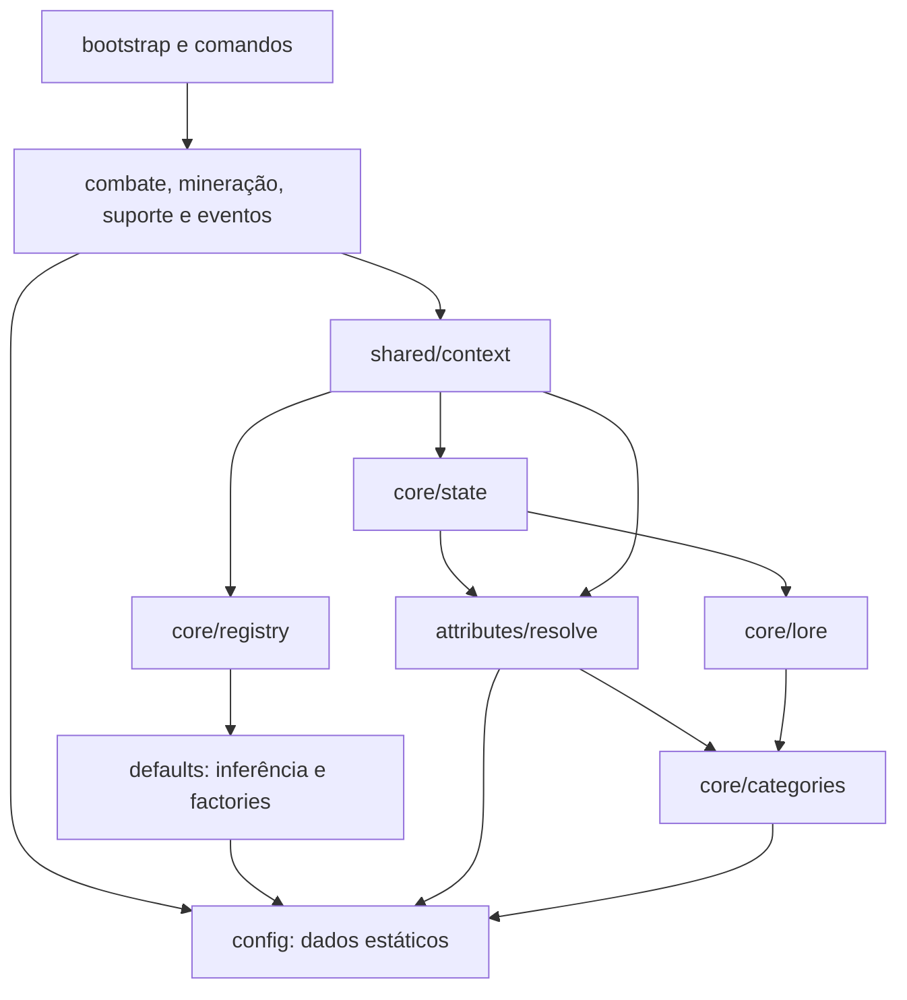

# StatsCore: arquitetura e configuração

## Levantamento anterior à reorganização

O núcleo ativo tinha 52 módulos JavaScript e 12.667 linhas. A análise considerou
os fontes locais, incluindo as alterações que já estavam em andamento, e os
imports da Refining Table, da configuração de receitas e de `ATCore/index.js`.
`data/legacy` é uma cópia histórica, não a entrada executada pelo pack atual.

| Área anterior | Responsabilidade | Dados misturados à execução |
| --- | --- | --- |
| `constants.js` | Contratos compartilhados | Propriedades, slots, tipos, afinidades, XP e tempos |
| `defaults.js` | Inferência e construção de definições | Materiais, multiplicadores, grupos de equipamentos e presets de habilidades |
| `core/state.js`, `progression/attributes.js`, `core/lore.js` | Persistência e apresentação da progressão | Categorias e critérios de habilitação repetidos |
| `attributes/resolve.js` | Resolução dos atributos | Modificadores de afinidade, preservação e limites |
| `mining/index.js`, `utility/index.js` | Eventos de mineração e uso | Tabelas de minério, drops, solos e cultivos |
| `shared/entityCategories.js`, `combat/effects.js` | Seleção de alvos e efeitos | Categorias, membros e tokens de entidades |
| `support/*` | Mitigação e mobilidade | IDs do componente, limites, slots e modos |
| `effects/*`, `feedback/index.js`, `icons.js`, `shared/messages.js` | Estados temporários e apresentação | Catálogos, aliases, glyphs e IDs dos protocolos Insight |
| `refining/*`, `commands.js` | Rolagens, herança e comandos | Compatibilidade de tipos, doadores e presets |

Duplicações identificadas:

- XP base `60` e crescimento `1.22` em `constants.js` e `defaults.js`.
- Limite de dano direto de refino `18` na normalização, no catálogo e nos comandos.
- Defaults de crítico e penetração no resolvedor e nos módulos de combate.
- Redução fixa de escudo `0.6` na definição e no cálculo da armadura equipada.
- Categorias de progressão, modos de botas e strings dos slots nativos.
- Namespace Insight idêntico nas pontes de actionbar e efeitos.

Valores iguais nem sempre representam a mesma regra. Limites de caches diferentes
continuam com nomes independentes, assim como o limite agregado de armadura e o
limite de um componente. Presets de habilidades e fallbacks de execução também
podem ter valores diferentes: por exemplo, o preset de Boot Dash e o fallback do
handler. Essa diferença foi mantida.

O grafo anterior tinha um ciclo interno:

```text
core/state.js → attributes/resolve.js → core/state.js
```

O resolvedor precisava apenas das consultas de categorias, mas importava o módulo
de persistência inteiro. Não foram encontrados imports relativos ausentes.

## Estrutura implementada

```text
StatsCore/
  config/
    values.js           defaults numéricos, limites e modificadores
    definitions.js      propriedades, IDs, progressão, status e protocolos
    equipmentTypes.js   tipos, slots, grupos de equipamentos e aliases de tiers
    materials.js        dados de materiais, durabilidade e multiplicadores
    abilities.js        templates estáticos e presets por material
    entities.js         categorias, membros e tokens de entidades
    mining.js           blocos, drops, solos e cultivos
    refinement.js       metadados de refino, doadores e presets de comandos
    presentation.js     glyphs, estilos, aliases e rótulos de mobilidade
  core/categories.js    consultas das categorias de progressão
  defaults.js           inferência, escalonamento e construção das definições
  core/                 estado, equipamento, refino e lore
  attributes/           resolução dos atributos efetivos
  progression/          curvas de XP e persistência do progresso
  combat/               execução de dano, crítico, penetração e efeitos
  mining/               execução da mineração e geração de loot
  support/              armadura, componente, botas e Elytra
  utility/              interação com itens e blocos
  eventDriven/          efeitos ligados aos demais eventos
  effects/              estado temporário e publicação no Insight
  feedback/, shared/    apresentação, contexto e operações compartilhadas
```

Os arquivos em `config/` só importam outros arquivos de `config/`. Não registram
componentes, não assinam eventos, não consultam o mundo e não armazenam caches,
cooldowns ou entidades. Os pequenos construtores de metadados do catálogo e a
qualificação de IDs de entidades apenas montam dados estáticos.



O módulo `core/categories.js` remove o ciclo. A consulta continua exportada pelo
caminho antigo `core/state.js`; lore e atributos usam o módulo de consulta
diretamente. A escolha de categorias ativas é lógica e permanece fora de `config/`.

As factories continuam criando efeitos mutáveis novos. Arrays de tipos de dano
dos templates de armadura são copiados para cada efeito, evitando que alterar
uma definição modifique o template ou outro equipamento. Fórmulas dependentes de
material, contexto, desbloqueios ou overrides continuam nos módulos responsáveis.

## Contratos preservados

- `API.js`, `index.js`, `main.js` e os exports existentes continuam disponíveis.
- `constants.js`, `icons.js`, `effects/catalog.js`, `refining/commandCatalog.js`,
  `refining/inheritance.js`, `shared/entityCategories.js`, `feedback/index.js`,
  `support/armorComponent.js` e `core/state.js` preservam os exports movidos por
  reexportação. Os objetos públicos reexportados são os mesmos objetos de configuração.
- Identifiers de itens, blocos, entidades, componentes, comandos, propriedades e
  script events mantêm os valores anteriores. As versões de persistência não mudaram.
- A precedência da inferência por identifier, tags, componentes e durabilidade
  foi mantida, incluindo aliases e fallbacks para equipamentos de outros addons.
- A API de registro explícito e a nova tentativa com um ItemStack após uma
  consulta sem sucesso por identifier continuam funcionando.
- Os filtros de execução de combate e mineração mantêm suas condições anteriores.
  As listas de compatibilidade do catálogo não substituem filtros que aceitam
  definições externas com outros tipos.
- A ordem de inicialização, os eventos assinados, os tempos e os limites dos caches
  permanecem iguais. Não foi feita otimização de performance.
- A configuração da máquina permanece em `BP/scripts/config/recipes/refiningTable.js`.
  Seus custos, receitas e contratos não foram transferidos para o núcleo.

O refactor não corrigiu divergências preexistentes de gameplay ou de documentação.
Por exemplo, os overrides fixos de Bleeding continuam prevalecendo sobre o preset
por tier. Os antigos `SUPPORT_SLOT_SCALARS`, sem consumidor ativo, foram identificados
como dados legados na configuração.

## Etapas e verificação

1. Introdução da base de configuração, compatibilidade de imports e separação de
   categorias para remover o ciclo.
2. Extração dos dados de materiais, classificações de equipamentos e templates de
   habilidades, preservando a construção dinâmica.
3. Extração dos catálogos e tabelas restantes, adoção dos defaults compartilhados
   e conferência dos consumidores externos.

Auditoria local, a partir da raiz do projeto:

```powershell
node --experimental-vm-modules tools/audit-statscore-config.mjs
```

A auditoria verifica imports e ausência de ciclos, a direção das dependências de
configuração, o bundle do núcleo e da Refining Table, equipamentos, estado, lore,
XP, herança, rolagens, limites de armadura, expiração de efeitos e inicialização.
Ela usa doubles da API do Minecraft em uma VM isolada, sem executar no jogo.

Durante a reorganização, uma cópia temporária dos fontes anteriores permitiu
comparação determinística usando `--baseline <snapshot.json>`. O snapshot é um
objeto JSON que associa caminhos relativos aos respectivos fontes. Passaram
2.801 comparações, incluindo tabelas antes privadas, com 658 identifiers de teste
e 310 equipamentos reconhecidos. A cópia foi feita do estado local anterior,
não de `HEAD`, para preservar o trabalho que já estava em andamento.

A validação em um mundo Bedrock permanece necessária para observar a integração
real de eventos, animações e feedback; a auditoria não simula o motor do jogo.
