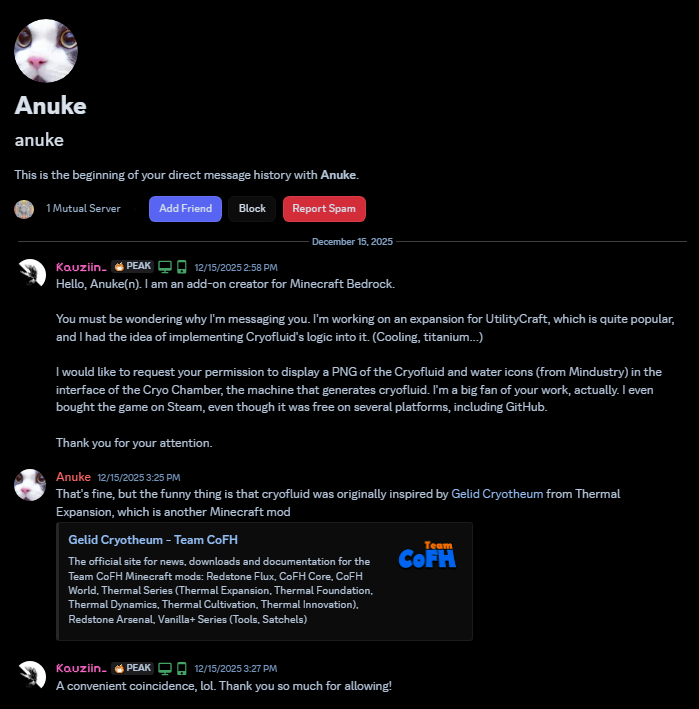

# Ascendant Technology
An official expansion add-on for UtilityCraft, aiming to add more end-game content.
---
This project was created just because I wanted more useful stuff. It turned out to be my greatest creation, made with passion and lots of challenges.

Here, you have:
- Cool UI — Some machines have a rich, pleasant to the eyes User Interface.
- Cool Armor — This expansion brings with it the first armor to ever exist in UtilityCraft.
- More content to grind — Additional content is available to discover, whether it's in the Overworld or The End.
- Better versions of UtilityCraft machines — Similar to the recente Tiered Machinery, Ascendant Technology brings with it up versions of UtilityCraft's machines, with better logic, more slots and more energy capacity.
- Way more stuff to do and store — Complex systems of duplication, complex chambers meant to kill mobs and make mob grinding easier… the possibilities are endless.
- A bigger chest — Way more storage for the player, to match the amount of items that UtilityCraft brings with it.
And way more!

See every planned feature [here](./Machine_Roadmap.md)

This addon is on beta right now, so you may find bugs and features that does not work correctly.

## [ [Download](https://github.com/DoriosStudios/Ascendant-Technology/releases) ]   

---

See also:
- **[UtilityCraft](https://github.com/DoriosStudios/UtilityCraft)** *(Main Add-on)*
- **[Heavy Machinery Expansion](https://github.com/DoriosStudios/UtilityCraft-Heavy-Machinery)**
- [Known Bugs](./bugs.md).

---

Water and Cryofluid icons are **NOT** mine.

The creator of Mindustry, Anuke(n), has granted permission for the use of these assets. See the original work:
https://github.com/Anuken/Mindustry  

- Permission:  

