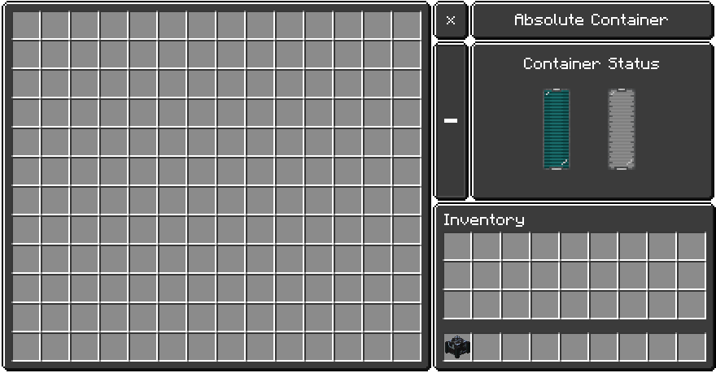

# Absolute Container

A late-game singular vault that combines massive item storage with internal energy and fluid reserves in one block.

## What it does
- Stores up to 168 item slots in a 14×12 grid.
- Keeps internal energy and fluid tanks with 25.6M capacity each.
- Shows a dedicated HUD for energy and fluid (no extra labels).

## How to use
1. Place the block and open its inventory.
2. Store items in the main grid.
3. Connect cables/pipes for energy and fluids if you want network integration.

## Inputs and outputs
- Items: the machine automatically pushes items from the last 9 slots of the grid to the block in its facing direction.
- Fluids: the internal tank transfers fluids to adjacent connections.

## Energy and fluid
- Energy capacity: 25,600,000 DE.
- Fluid capacity: 25,600,000 mB.
- Storage capacity: 168 slots.

## Upgrades
- None.
