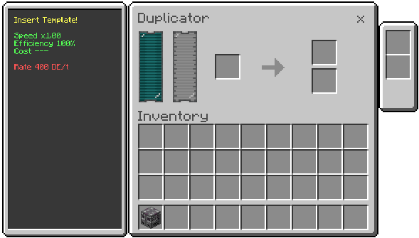

# Duplicator (Cloner | Replication Matrix)

Template-driven replication chamber that duplicates one item per craft using energy and Liquified Aetherium.

## What it does
- Uses a template to generate output as **original + copy**.
- Preserves template metadata on output (name, lore, and enchantments).
- Uses rarity-based runtime and cost profiles.
- Supports declared rarities up to **Transcendent**.
- Falls back to an **Unknown** profile for undeclared templates.

## How to use
1. Insert the template in slot **3**.
2. Fill the internal tank with **Liquified Aetherium**.
3. Wait for processing.
4. Collect items from:
	 - **Slot 7**: original stream
	 - **Slot 8**: copy stream

## Slot layout (inventory size: 21)
- **0**: energy HUD
- **1**: status indicator
- **2**: progress display
- **3**: template input
- **4, 5**: upgrade slots
- **6**: fluid display (internal)
- **7**: original output
- **8**: copied output
- **9-14**: item I/O configuration
- **15-20**: fluid I/O configuration

## Restrictions
- Cannot duplicate:
	- Lucky tools (`utilitycraft:lucky_sword`, `utilitycraft:lucky_pickaxe`, `utilitycraft:lucky_aiot`)
	- Data-sensitive templates (`minecraft:banner`, `minecraft:potion`)
	- `minecraft:shulker_box`
- Singularity templates are routed to the **Singularity Fabricator**.
- Cannot duplicate itself.

## Machine Capabilities
- **Energy Capacity**: 512,000,000 DE (512 MDE)
- **Processing Rate**: 16,000 DE/tick (16 kDE/t)
- **Fluid Tank Capacity**: 512,000 mB (512 buckets)
- **Fluid Consumption**: 50 mB/s of effective recipe time
- **Upgrade Slots**: 2 (slots 4 and 5)

## Runtime model

Each craft is computed from rarity profile:
- `base_cost = 1,600,000 DE` (1,600 kDE)
- `declared_base_time = 1,800s` (30 min)
- `undeclared_base_time = 60s`

### Declared rarity profiles (before speed/overclock modifiers)

| Rarity | Time Multiplier | Cost Multiplier | Total Time | Total Cost |
| --- | --- | --- | --- | --- |
| Common | 1.00 | 1.00 | 1,800s | 1,600,000 DE |
| Uncommon | 1.75 | 2.00 | 3,150s | 3,200,000 DE |
| Rare | 3.50 | 3.50 | 6,300s | 5,600,000 DE |
| Epic | 6.00 | 5.00 | 10,800s | 8,000,000 DE |
| Legendary | 8.25 | 10.00 | 14,850s | 16,000,000 DE |
| Mythic | 10.00 | 15.00 | 18,000s | 24,000,000 DE |
| Transcendent | 12.50 | 25.00 | 22,500s | 40,000,000 DE |

### Unknown templates (fallback)

If a template is not in the rarity map, the machine runs in **Unknown** mode:
- Rarity shown in HUD: `(Unknown)`
- Base time: **60s**
- Base cost: **1,600,000 DE**

## Fluids
- Only **Liquified Aetherium** is accepted.
- If a wrong fluid is in tank, processing is blocked until corrected.

## Output behavior
- Per craft, the generic profile outputs:
	- input amount consumed from slot 3 (normally 1)
	- original amount added to slot 7 (normally 1)
	- copy amount added to slot 8 (normally 1)

Net result for a standard template craft is **2 units total** (original + copy).
