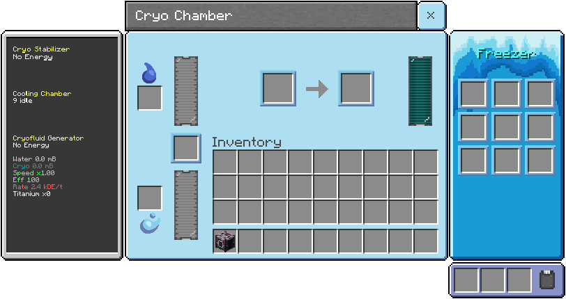

# Cryo Chamber

Multifunction thermal stabilizer running three modules in parallel: Cryo Stabilizer, Cooling Chamber, and Cryofluid Generator.

## Modules (run at the same time)
### Cryo Stabilizer
- Stabilizes volatile or/and charged materials using Cryofluid.
- Input: stabilizer slot.
- Output: stabilizer slot.
- Requires energy and, when the recipe asks for it, Cryofluid.

### Cooling Chamber (3×3 grid)
- Cools items and food into cold variants.
- Each grid slot is processed independently.
- Some recipes require water or Cryofluid (see recipes).

### Cryofluid Generator
- Converts water into Cryofluid.
- Requires energy and a catalyst (Titanium or Raw Titanium).
- Outputs Cryofluid into the dedicated tank.
> [!NOTE]
> Cryofluid will be a better coolant for [Heavy Machinery Expansion](https://github.com/doriosstudios/utilitycraft-heavy-machinery) reactors in the future.

## Tanks
- Water tank (input) and Cryofluid tank (output).
- Default capacity: 64,000 mB (configurable in the machine definition).

## Upgrades
- Speed/efficiency upgrades affect all modules.

## Recipes
See the [recipe page](../recipes/cryo-chamber.md).
