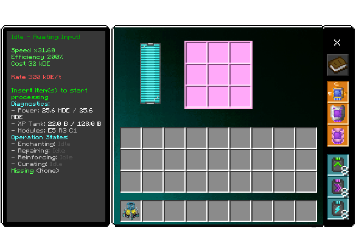
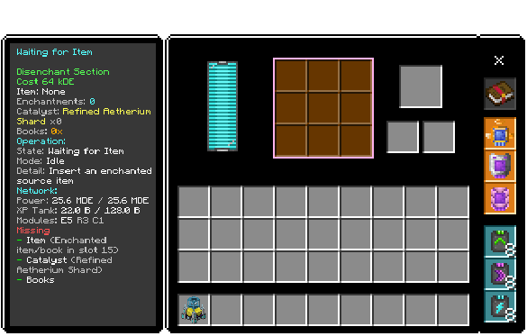

# Enchantment Station

 

Station for enchanting, curse curation, reinforcement management and disenchanting.

## What it does
### Enchantment and reinforcement
- Processes tools/armor in a 3x3 main grid.
- Applies or upgrades enchantments based on installed modules.
- Supports curse curation (remove configured curses).
- Applies reinforcement points to durability items.
### Disenchanting
- Supports two disenchant modes:
  - **Extract mode**: Uses catalysts and books to convert enchantments into enchanted books.
  - **Absorb mode**: Converts enchantments directly into XP fluid when catalysts/books are missing, with a processing delay.

## Machine capabilities
- **Energy Capacity**: 25,600,000 DE (25.6 MDE)
- **Base Energy Cost**: 8,000 DE (scaled by operation inflation rules)
- **Base Machine Rate**: `rate_speed_base = 64,000` (dynamic runtime enabled)
- **XP Tank Capacity**: 128,000 mB (fluid type `xp`)
- **Inventory Size**: 43 slots
- **Upgrade Slots**: 2 (19, 20)

## Slot layout
- **0**: Energy HUD
- **1**: Main Status
- **2**: Progress Display
- **3-11**: Main processing grid
- **12-14**: Module slots
- **15**: Disenchant source
- **16**: Disenchant catalyst
- **17**: Book storage
- **18**: Disenchant progress
- **19-20**: Upgrades
- **21-29**: Disenchant outputs
- **30**: Disenchant HUD status
- **31-36**: Item I/O configuration
- **37-42**: Fluid I/O configuration

## Modules
### Enchantability Modules
Controls enchanting behavior and available enchantments, with a total of 5 levels:
- **Level 1 Enchantments**: 
  - Sharpness, Smite, Bane of Arthropods, Impaling, Efficiency, Power, Density - I
  - Protection, Fire Protection, Blast Protection, Projectile Protection, Feather Falling, Piercing, Breach - I
  - Unbreaking, Fortune, Luck of the Sea, Lure, Loyalty, Quick Charge, Respiration, Thorns, Swift Sneak, Soul Speed, Wind Burst, Lunge, Depth Strider, Riptide, Looting - I
- **Level 2 Enchantments**:
  - Sharpness, Smite, Bane of Arthropods, Impaling, Efficiency, Power, Density - II
  - Protection, Fire Protection, Blast Protection, Projectile Protection, Feather Falling, Piercing, Breach - II
  - Unbreaking, Fortune, Luck of the Sea, Lure, Loyalty, Quick Charge, Respiration, Thorns, Swift Sneak, Soul Speed, Wind Burst, Lunge, Depth Strider, Riptide, Looting - I
- **Level 3 Enchantments**:
  - Sharpness, Smite, Bane of Arthropods, Impaling, Efficiency, Power, Density - III
  - Protection, Fire Protection, Blast Protection, Projectile Protection, Feather Falling, Piercing, Breach - II
  - Unbreaking, Fortune, Luck of the Sea, Lure, Loyalty, Quick Charge, Respiration, Thorns, Swift Sneak, Soul Speed, Wind Burst, Lunge, Depth Strider, Riptide, Looting - II
  - Knockback, Fire Aspect, Punch, Frost Walker - I
- **Level 4 Enchantments**:
  - Sharpness, Smite, Bane of Arthropods, Impaling, Efficiency, Power, Density - IV
  - Protection, Fire Protection, Blast Protection, Projectile Protection, Feather Falling, Piercing, Breach - III
  - Unbreaking, Fortune, Luck of the Sea, Lure, Loyalty, Quick Charge, Respiration, Thorns, Swift Sneak, Soul Speed, Wind Burst, Lunge, Depth Strider, Riptide, Looting - II
  - Knockback, Fire Aspect, Punch, Frost Walker - II
- **Level 5 Enchantments**:
  - Sharpness, Smite, Bane of Arthropods, Impaling, Efficiency, Power, Density - V
  - Protection, Fire Protection, Blast Protection, Projectile Protection, Feather Falling, Piercing, Breach - IV
  - Unbreaking, Fortune, Luck of the Sea, Lure, Loyalty, Quick Charge, Respiration, Thorns, Swift Sneak, Soul Speed, Wind Burst, Lunge, Depth Strider, Riptide, Looting - III
  - Knockback, Fire Aspect, Punch, Frost Walker - II
  - Mending, Silk Touch, Infinity, Multishot, Channeling, Aqua Affinity, Flame - I

There is a chance of 15% per enchantment level to get a curse instead of a regular enchantment.

### Reinforcement Modules
Provides reinforcement points to increase item durability, with 3 levels:
- **Level 1**: 25% reinforcement target
- **Level 2**: 50% reinforcement target
- **Level 3**: 100% reinforcement target

Applies to armor and tools, but not to items with no durability or only enchantments (e.g., Elytra).

### **Curse Protection module**
Prevents application of curses during enchanting and allows removal of configured curses from items. Curse curation is available at all enchantability levels and does not require reinforcement modules.

## Reinforcement behavior

### Reinforcement target by module level
Reinforcement target is derived from item max durability:
- Lv0: 0%
- Lv1: 25%
- Lv2: 50%
- Lv3: 100%

When station processing completes and reinforcement is needed, the item is set to:
- `current = target`
- `max = target`

### Display and persistence
- Reinforcement lore format is:
  - `Reinforcement: <current> / <max>`
- Dynamic properties used:
  - `utilitycraft:reinforcement`
  - `utilitycraft:reinforcement_max`
  - `utilitycraft:reinforcement_sync_version`
- Legacy items using old lore (`Reinforcement: X`) are still read and synchronized.

### Runtime durability reaction (3-tick delay)
Reinforcement reactions are queued with a **3 tick delay** on:
- Item use (`itemUse`, main hand)
- Entity hit (`entityHitEntity`, attacker main hand)
- Block break (`playerBreakBlock`, player main hand)
- Taking damage (`entityHurt`, armor slots)

When triggered, the system repairs as much missing durability as possible using remaining reinforcement points:
- Restore amount is capped by: `min(remaining points, missing durability)`
- Reinforcement points are spent 1:1 with restored durability

This means reaction repair is **full missing-durability restoration within remaining reinforcement budget**, not just the durability lost in that single action.

### Future mitigation hook (planned, disabled)
A commented pre-release hook is prepared for API 2.6.0+ (`beforeEvents.entityHurt`) to reduce incoming damage by reinforced equipped pieces (including Offhand shield). It is intentionally disabled until API/runtime stability.

## Disenchant modes

### Extract mode
Requirements:
- Enchanted source item in slot 15
- Valid catalyst in slot 16
- Books in slot 17
- Free output space in 21-29

Result:
- Converts enchantments to enchanted books in output slots.
- Consumes catalyst and books per extracted enchantment.

### Absorb mode
If catalyst/books are missing, the station can queue absorb mode:
- Delay: `100 ticks` (default)
- Converts enchantments directly into XP fluid (`xp`) in the tank.
- Tracks absorb usage through machine properties.

## Notes
- The station uses dynamic operation time and cost based on active work type (repair, reinforcement, enchanting, disenchanting).
- Main and disenchant sections have independent HUD diagnostics, including missing-resource hints.
