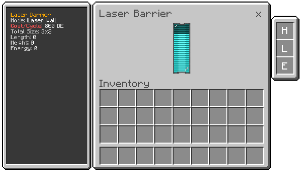

# Laser Barrier

Defensive controller that projects a laser wall in the block's facing direction and periodically damages entities in the area.

## What it does
- Creates a laser field with configurable width and height.
- Consumes energy continuously to sustain the field.
- Pulses damage to creatures within range.

## How to use
1. Place the block facing the direction where you want the wall.
2. Keep power supplied to the block.
3. Install upgrades by right-clicking while holding the upgrade.
4. Sneak with an empty hand to remove installed upgrades.

## Upgrades
- Length (Size Upgrade): increases wall length.
- Height (Size Upgrade): sneak while applying to increase height.
- Energy Upgrade: reduces cost per cycle.
- Limits: up to +8 length/height and up to 8 energy levels.

## Notes
- The field disappears when energy runs out.
- Sneaking players are not damaged by the pulse.
- No UI; upgrades are applied via direct interaction.
