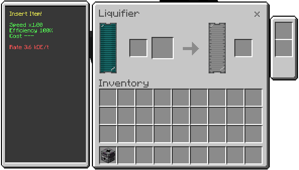

# Liquifier (Flux Crucible)

Thermal crucible that melts solids into fluid, with a chance of residue.

## What it does
- Converts solid items into fluid in the internal tank.
- Can produce secondary residue.
- Pushes fluid to adjacent connections when available.

## How to use
1. Insert the solid item in the input.
2. Ensure there is space in the fluid tank.
3. Extract the fluid via pipes/capsules and take residue from the dedicated slot (if any).

## Inputs and outputs
- Input: solid items supported by recipes.
- Outputs: fluid in the internal tank and optional residue.

## Fluids
- The tank receives the fluid produced by the recipe.
- The capsule slot lets you transfer fluid between capsules and the tank.

## Energy
- Cost per recipe (see the recipe page for details).

## Upgrades
- Uses the machine's standard upgrade system (when configured).

## Recipes
See the [recipe page](../recipes/liquifier.md).
