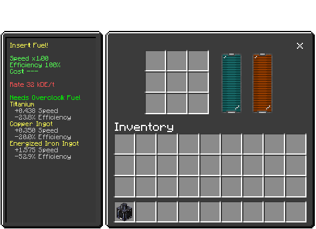

# Overclock Tower

## Overview
The **Overclock Tower** is the core generator of the Overclock Boost Network system. It consumes energy and fuel materials to produce an overclock charge that enhances machine performance across your factory network.

## Purpose
The Overclock Tower serves as the foundation of AT's unique performance enhancement system, providing controlled boosts to connected machines through a dedicated network infrastructure.

## Crafting


## How It Works

### Energy and Fuel System
The Overclock Tower requires two resources to function:
- **Energy**: Base consumption of 32,000 DE/tick (scales with power level)
- **Fuel**: Specific materials that determine overclock level and effectiveness

### Fuel System
The tower has **9 fuel slots** (slots 2-10) that can burn different materials simultaneously:

#### Fuel Types
| Fuel | Duration | Power Level | Effectiveness | Speed Bonus | Notes |
|------|----------|-------------|---------------|-------------|-------|
| **Titanium** | 500 ticks | 1.0 | 1.25× | +0.438/fuel | Balanced option |
| **Copper Ingot** | 400 ticks | 0.5 | 2.0× | +0.350/fuel | High efficiency |
| **Energized Iron Ingot** | 50 ticks | 3.0 | 1.5× | +1.575/fuel | Maximum power |

#### How Fuels Work
- **Power Level**: Contributes to the total overclock level (stacks additively)
- **Effectiveness**: Multiplier applied to the overclock effect
- **Speed Bonus**: Actual machine speed increase = `0.35 × (Power × Effectiveness)`
- **Energy Cost**: Scales with power level: `32,000 × max(1, totalPower / 2)` DE/tick

### Multi-Fuel Operation
You can insert different fuels in multiple slots simultaneously:
- Total power level = sum of all active fuel power levels
- Effectiveness = highest effectiveness value among active fuels
- Each fuel slot burns independently with its own timer

**Example**: Using 3 Titanium + 2 Copper Ingots simultaneously:
- Total Power = (3 × 1.0) + (2 × 0.5) = 4.0
- Effectiveness = max(1.25, 2.0) = 2.0
- Effective Speed Boost = 0.35 × (4.0 × 2.0) = +2.800 Speed
- Energy Cost = 32,000 × max(1, 4.0 / 2) = 64,000 DE/tick

## Network Distribution
The Overclock Tower distributes its charge through:
1. **Direct Connection**: Place an **Overclock Relay** adjacent to or connected via **Reinforced Cable**
2. **Energy Sharing**: Automatically shares excess energy with connected relays (20,000 DE/tick per relay)
3. **Range**: Scans up to 96 network nodes to find connected relays

## UI Elements

### Energy Bar
- Displays current energy level and capacity
- Tower capacity: 102,400,000 DE
- Red when insufficient energy for operation

### Fuel Slots (Grid Layout)
```
[Slot 2] [Slot 3] [Slot 4]
[Slot 5] [Slot 6] [Slot 7]
[Slot 8] [Slot 9] [Slot 10]
```
Insert overclock fuel materials into any or all slots.

### Overclock Display (Slot 11)
- Shows current overclock level and effectiveness
- Animated bar indicates active overclock generation
- Hover for detailed fuel contribution breakdown

### Status Display
When operating:
- Shows "Overclock Charge" with active fuel contributions
- Lists each fuel type with its speed bonus and effectiveness multiplier
- Footer displays total overclock level

When idle:
- "Insert Fuel" warning with list of possible fuel types and their bonuses
- "Low Energy" warning when insufficient power available

## Technical Details

### Properties
- **Energy Capacity**: 102,400,000 DE
- **Base Energy Cost**: 32,000 DE/tick (scales with power)
- **Inventory Size**: 12 slots (internal slots 0-1, fuel slots 2-10, overclock display slot 11)
- **Internal Slots**: Slots 0 and 1
- **Upgrade Slots**: None (upgrades not supported)

### Block States
- `utilitycraft:on`: true/false (operating/idle)
- `utilitycraft:axis`: Orientation (north/south/east/west/up/down)
- `utilitycraft:rotation`: 0-3 (visual rotation)

### Visual Indicators
- **Texture**: Changes between "off" and "on" states
- **Light Emission**: Level 6 when active
- **Orientation**: Can be placed in any orientation

## Usage Tips
1. **Start Simple**: Begin with a single fuel type (Titanium) to understand the system
2. **Monitor Energy**: Ensure your energy generation can support the scaled energy cost
3. **Mix Fuels**: Combine different fuels for optimal power-to-efficiency ratio
4. **Strategic Placement**: Place near your relay network hub for efficient distribution
5. **Relay Network**: One tower can power multiple relays across your factory

## Warnings
- **High Energy Demand**: Energy cost scales significantly with overclock level
- **No Generators**: Overclock does NOT boost generator output (prevents infinite loops)
- **Network Required**: Overclock only affects machines connected through the relay network
- **Fuel Management**: Empty fuel slots reduce overall performance

## Integration
Works seamlessly with:
- **Overclock Relay**: Distributes overclock charge to machine networks
- **Reinforced Cable**: Connects tower to relays and provides energy/fluid transfer
- **All AT Machines**: Any machine tagged with `dorios:machine` (except generators)

## See Also
- [Overclock Relay](./overclock-relay.md)
- [Reinforced Cable](./reinforced-cable.md)
- [Overclock Network Overview](./overclock-network.md)
