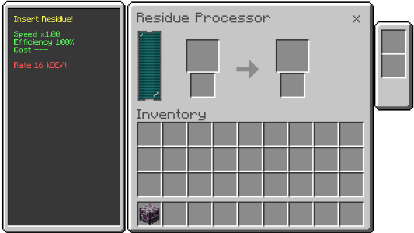

# Residue Processor

Residue processor that converts debris into reclaimed materials, with a chance of byproduct.

## What it does
- Consumes residue and produces a main item.
- Can produce a byproduct with a recipe-defined chance.

## How to use
1. Insert residue in the input slot.
2. Wait for processing.
3. Take the main output and byproduct (if any).

## Inputs and outputs
- Input: residues defined by recipe.
- Output: main item + optional byproduct.

## Energy
- Cost per recipe (see recipe page).

## Upgrades
- Uses the machine's standard upgrade system (when configured).

## Recipes
See the [recipe page](../recipes/residue-processor.md).
