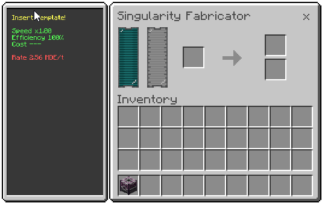

# Singularity Fabricator

Extreme variant of the Duplicator, focused on singularity items and absurdly high costs.

## What it does
- Uses templates to generate the original item + one copy.
- Consumes Dark Matter instead of Liquified Aetherium.
- Enforces very high minimum time and energy costs.

## How to use
1. Insert the template in the main slot.
2. Fill the tank with Dark Matter.
3. Wait for the process and collect original and copy from dedicated slots.

## Energy and time
- Minimum time per craft: 3,600s (1h).
- Minimum cost per craft: 55,296,000,000 DE (≈55.3 GDE).
- Cost scales with `rate_speed_base` via the dynamic time calculation; longer recipes still raise the total cost.

## Fluids
- Only Dark Matter (internal tank).

## Upgrades
- Does not support upgrades; You will suffer.

## Recipes
See the [recipe page](../recipes/singularity-fabricator.md).
